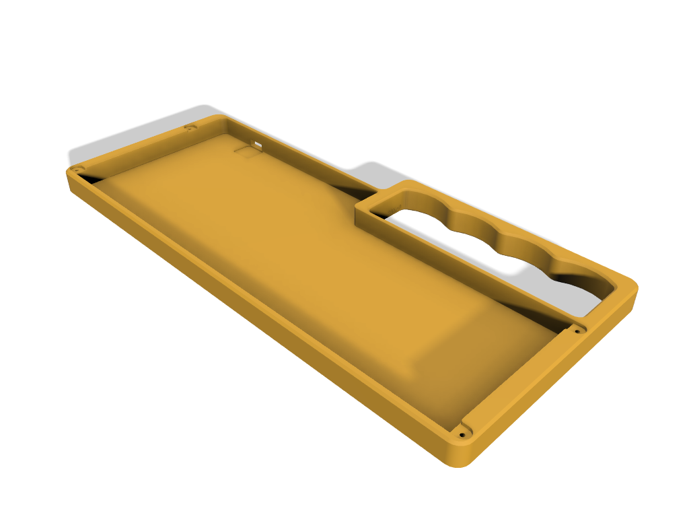
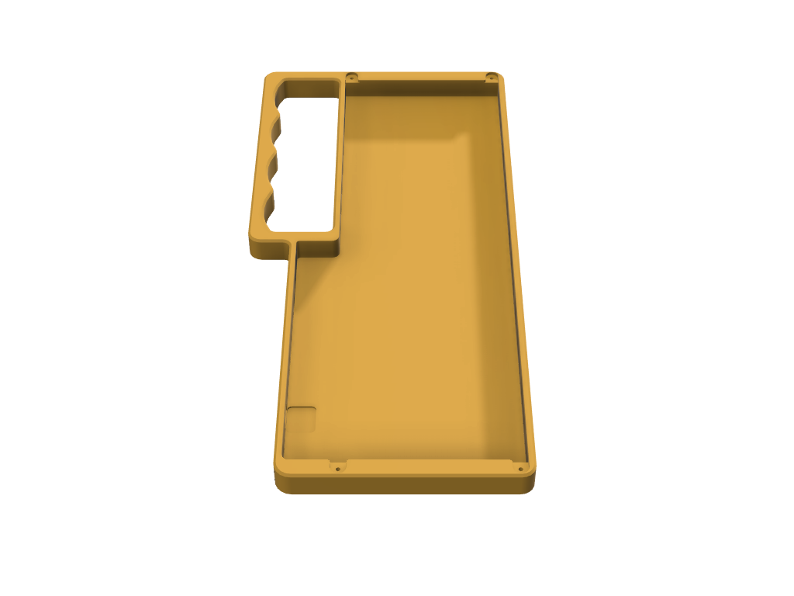
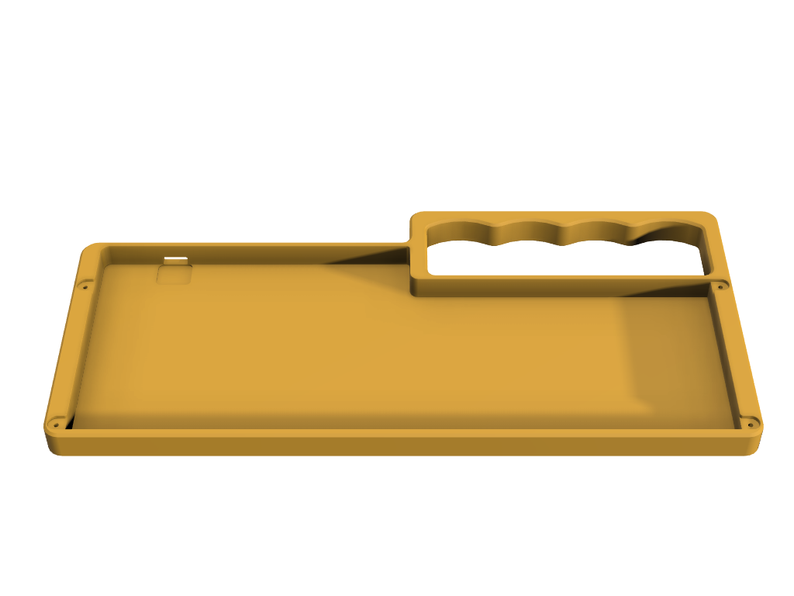

# Vandal

 

Vandal (previously codenamed KnuckV4NHull) is a low profile case for V4N4G0N-compatible PCBs.

It is a mixed derivative from Knuckhull and V4N4G0N R3 case aka. Hullagon. While both of those cases have metal construction, current version of Vandal is designed with 3D printing specifications and not tested for CNC or any other metal construction.

Vandal uses [V4N4G0N's Hull-style plate (R3)](https://trashman.wiki/en/files#v4n4g0n).

## Version

There are 2 versions of Vandal based on screw mounting methods:

* [Regular](cases/Vandal-v3.stl), using M2x4 or M2x6 self tap screws.
* [Heatset](cases/Vandal-Heatset-v3.stl), using M2 heatset insert with regular M2x4 or M2x6 screws.

## Credit

[TheBlackHammer](https://www.thehammerforge.xyz/)'s Knuckhull, [V4N4G0N R3 case](https://trashman.club/page/vanagon-r3), [Kiser Design](https://kiserdesigns.bigcartel.com/) for printing tests and feedback - and the possibility of making this design available in store, community members who happened to be in #kiser-rolls channel in [40% Keyboards Discord](https://discord.gg/40percent) when the new name was discussed, and also people in 40% Keyboard Discord in general.

## Notes

This case is released with MIT License, so feel free to modify, extend or integrate them. As per license, there will be no warranty or liability related to these cases.

If you like this case and find it useful, you can [buy me a coffee](https://www.buymeacoffee.com/coffeeforba).
